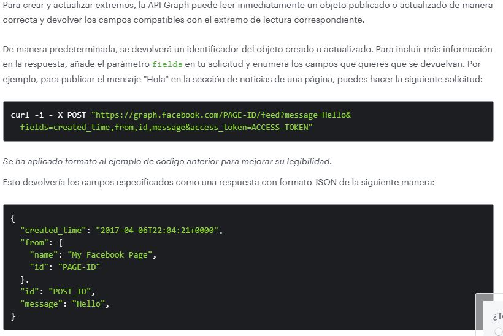

# Tutoria
Pagina web que mostrará información relevante sobre los tutores de la facultad

Especificaciones
- Apartado que muestre
  - DAE
  - DAU
  - Secretaría académica
  - Directorio de la facultad (Información de los profesores, sus cubículos)
- Cómo ubicar a los tutores (De acuerdo con la sección)

## Obtener posts de facebook de forma automática
Utilizar la API GRAPH de facebook, se necesita un token de acceso linkeada a la página
Aquí se obtienen diferentes datos a partir de una consulta

Para consultar más información, en el siguiente link obtiene datos de tu perfil de facebook
https://developers.facebook.com/docs/graph-api/get-started

Obtener información sobre los campos disponibles
https://developers.facebook.com/docs/marketing-api/insights/parameters/v16.0

- Crear una API graph default
- Vincular páginas con usuario
- Realizar las pruebas con página para acceder a los datos de la publicación, en cualquiero otro caso no dejará

Usuario David id: 4214126145479991
Prueba tutoría id: 100344976347250
Pagina ejemplo id: 111397078553497

Consultas comunes:
### Consula el nombre y el id del usuario asociado a la APP 
  me?fields=id,name  
### Consultar id y nombre de todas las páginas asociadas al perfil >>
  USER-ID/accounts?                 (Reemplazar por el id del usuario)
  fields=name,access_token&         
  access_token=USER-ACCESS-TOKEN"    (token de larga duración EAAJyuJXSO2IBACZBZC302lHSPtuDfSlCho1C39666UeLDTTsFu1qhJXie0Gcqf7ZCF5TQcNdf1cY2kEgAlf7ovahrWRvBA03hLYfZApNIcaZB0oZAZBtnyflgcj4EjNhGfdpvZBT1ObAUh53oHuorA79b56EMiX5lvFuzsE7xcNtpzo24ZBmpJfLh)

  4214126145479991/accounts?fields=name,access_token&access_token=EAAJyuJXSO2IBAMyyPd31PmfADnREQasMO8oft3IzylCTdNusGtAWR8tPKfd8WThDfapEQAsCYsJrzeZBtGX4BT7u1FiGeZAZCZAWLqYxzFba83s3YbZA88LkVo3LRy53e2OgQxlvDPBJEBlXnlBvZBSPMRRjSZBmnZBEJ6ZAWKnesp8rkZB2OQMlX9EbDwTNkUbOnuJDJjr5KrgSCcDWoqLNao
### Obtener todas las publicaciones (Hacerlo desde la página en explorador de api graph)
id-pagina     /Campos a mostrar /date_presents=today,yersterday,this_month, etc (Consultar página de arriba, no sirve date_presents)
100344976347250/feed?fields,created_time=permalink_url,&date_presets=today

PAGE-ID/feed?message=Hello&
  fields=created_time,from,id,message&access_token=ACCESS-TOKEN"